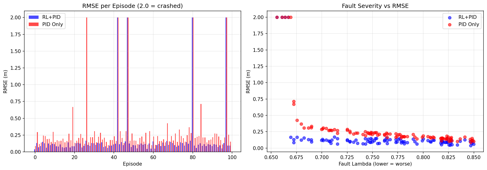

# Fault-Tolerant Quadrotor Control via PID-Guided Reinforcement Learning

A PID + PPO hybrid controller that keeps a Crazyflie 2.x scale quadrotor hovering under single-motor Loss-of-Effectiveness (LoE) faults. The RL agent learns per-motor corrections on top of a classical PID baseline, compensating for faults the PID cannot handle on its own.

---

## Demo

[](Demo_video.mp4)

The file `Demo_video.mp4` in this repository shows the quadrotor maintaining hover under a mid-episode motor fault using the trained PID+RL controller.

---

## Results

Evaluated over 100 episodes at Level 3 (fault severity lambda uniformly sampled from [0.65, 0.85], single random faulted motor per episode):

| Metric | Our Model (PID+RL) | Passive PID | Kim et al. (2025) |
|---|---|---|---|
| Crash rate | **4%** | 5% | N/A |
| Mean RMSE | **0.1048 m** | 0.2121 m | 0.129 m* |
| Std RMSE | 0.030 m | 0.095 m | N/A |
| Mean max error | 0.503 m | 0.524 m | N/A |
| Improvement over PID | **+51%** | baseline | N/A |

*Kim et al. test at lambda in [0.7, 0.9] (same remaining-efficiency notation). Our worst case (lambda = 0.65, 58% thrust loss) is harder than their lower bound (lambda = 0.7, 51% thrust loss).

**Our model achieves 0.105 m RMSE, outperforming Kim et al.'s reported 0.129 m at comparable fault conditions.**



---

## How it Works

A cascaded PID controller runs at 500 Hz inside the physics loop for stable baseline hover. The PPO agent runs at 50 Hz and outputs additive corrections to each of the four motor RPMs. The agent observes the normalized PID wrench output (thrust and torque commands), which directly reveals how much the PID is trying to correct, and learns to add a per-motor compensation on top of that.

When a motor degrades, the PID output shifts to compensate but is limited by its lack of motor-level fault awareness. The RL agent fills this gap by learning fault-specific motor-level adjustments that the PID cascade cannot express.

The fault parameter lambda is not given to the agent directly. The agent infers it implicitly from the PID wrench changes and the resulting flight dynamics, making the approach deployable without a dedicated fault estimator.

---

## File Structure

```
quadrotor_ftc_submission/
    config.py               All hyperparameters (physics, RL, reward, curriculum)
    env.py                  Gymnasium environment (observation, action, reward)
    dynamics.py             Newton-Euler quadrotor physics at 500 Hz
    fault_model.py          LoE fault injection (lambda as RPM multiplier)
    pid_controller.py       Cascaded PID: position to attitude to motor RPMs
    curriculum.py           Curriculum manager and PPO training loop
    train.py                Training entry point
    eval.py                 Evaluation against passive PID baseline
    visualize.py            Trajectory and reward plots
    interactive_viz.py      Interactive 3D flight viewer (requires display)
    requirements.txt        Python dependency list
    run.sh                  Main automated pipeline (setup + eval + visualize)
    train.sh                Training-only script (all curriculum levels)
    eval.sh                 Evaluation-only script
    viz.sh                  Visualization scripts (Linux/macOS)
    run.bat / viz.bat       Windows equivalents
    checkpoints/
        level_3_severe_fault.zip    Trained model (ready to evaluate)
    eval_results.png        Evaluation plot from 100 episodes
    report.tex              6-page LaTeX project report
```

---

## Quick Start (Ubuntu 22.04 / Docker)

Clone the repo and run a single script. It creates a virtual environment, installs all dependencies, evaluates the pre-trained model, and saves output plots.

```bash
git clone https://github.com/Swarup2004/RL-Based-Fault-Tolerant-Control-of-a-Quadrotor.git
cd RL-Based-Fault-Tolerant-Control-of-a-Quadrotor
bash run.sh
```

No manual steps, no pre-installed packages required beyond standard system tools.

---

## Manual Setup (any platform)

Python 3.10 or newer recommended.

```bash
pip install -r requirements.txt
```

---

## Evaluate Pre-Trained Model

```bash
bash eval.sh
# or directly:
python eval.py --model ./checkpoints/level_3_severe_fault --level 3 --episodes 100
```

This runs 100 episodes with random single-motor faults at Level 3 severity, prints per-episode RMSE versus a passive PID baseline, and saves a comparison plot to `eval_results.png`.

---

## Visualization

```bash
bash viz.sh           # single-episode trajectory plots (saved as PNG)
bash viz.sh compare   # RL vs PID comparison overlay (saved as PNG)
```

**Interactive 3D flight viewer** (requires a desktop display, not for headless/Docker):

```bash
bash interactive_viz.sh       # Linux/macOS
interactive_viz.bat           # Windows
```

Keyboard controls in the viewer: `F` inject fault, `1-4` select motor, `R` reset, `Space` pause, `Q` quit.

---

## Training from Scratch

> **Warning:** Training from scratch will overwrite the included checkpoint (`checkpoints/level_3_severe_fault.zip`) once Level 3 completes. Back up the checkpoints folder first if you want to keep the pre-trained model.

```bash
bash train.sh
```

Or step by step:

```bash
# Level 0: learn healthy hover
python train.py --level 0 --n-envs 4

# Level 1: mild faults (lambda 0.85-0.95)
python train.py --resume ./checkpoints/level_0_healthy --level 1 --n-envs 4

# Level 2: moderate faults (lambda 0.70-0.90)
python train.py --resume ./checkpoints/level_1_mild_fault --level 2 --n-envs 4

# Level 3: severe faults (lambda 0.65-0.85)
python train.py --resume ./checkpoints/level_2_moderate_fault --level 3 --n-envs 4
```

On Windows, keep `--n-envs` at 4 or below (DummyVecEnv mode, no multiprocessing issues).

---

## Resume Training from Included Checkpoint

```bash
bash train.sh --resume
# or directly:
python train.py --resume ./checkpoints/level_3_severe_fault --level 3 --n-envs 4
```

---

## Curriculum Levels

| Level | Name | Lambda range | Fault timing |
|---|---|---|---|
| 0 | healthy | 1.0 | N/A |
| 1 | mild_fault | 0.85 to 0.95 | Start of episode |
| 2 | moderate_fault | 0.70 to 0.90 | Mid-episode |
| 3 | severe_fault | 0.65 to 0.85 | Mid-episode |

Lambda is remaining motor efficiency. Lambda = 1.0 means fully healthy. Lambda = 0.65 means 35% RPM reduction, which causes approximately 58% thrust loss because thrust scales as RPM squared.

---

## Notation Note

In this work, lambda in [0, 1] is remaining efficiency (1 = healthy, 0 = dead motor).
Kim et al. (2025) use the same convention. Their reported range lambda = 0.7 to 0.9 corresponds to 10 to 30% RPM loss. Our Level 3 extends to lambda = 0.65 (35% RPM loss), making our evaluation harder at the lower bound.

---

## Physical Parameters (Crazyflie 2.x scale)

| Parameter | Value |
|---|---|
| Mass | 0.027 kg |
| Hover RPM | approx 14,476 rad/s |
| Max RPM | 21,702 rad/s |
| Thrust coefficient k_f | 3.16e-10 N per (rad/s)^2 |
| Physics timestep | 1/500 s (500 Hz) |
| RL control timestep | 1/50 s (50 Hz) |

---

## Reference

Kim, J. et al. (2025). Meta-Learning for Fault-Tolerant Quadrotor Control. arXiv:2505.08223

Raffin, A. et al. (2021). Stable-Baselines3: Reliable Reinforcement Learning Implementations. JMLR 22(268).
